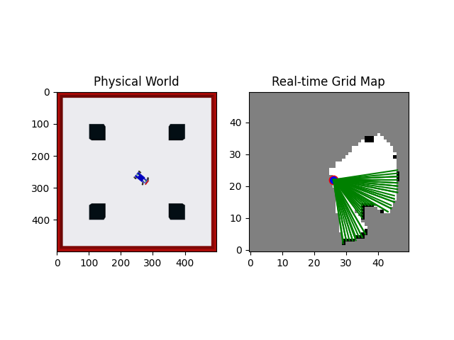
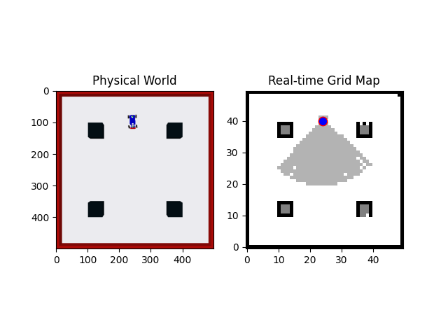

# Occupancy Grid Mapping

Version 4 of OGM has been released.

(11/15/2023)

## Update from previous version:

* Enable to display a ray cone in grid map based on the user's choices.
* Tuned refresh rate and made some modifications to increase running speed.
* Fixed some bugs.

## Feature Summary:

* Log odds representation
* Probabilistic grid map (Black: occupied; White: free; Grey: undetermined)
* Inverse sensor model
* Bresenham's line algorithm
* Get grids within ray cone
* Support different ray lengths
* Separated data collection and processing (to increase speed)

## Future Plan:

* Data structure optimization
* Visualization improvement
* Make it more generic (if needed)

## Dependencies:

* matplotlib
* numpy
* math
* decimal
* yaml
* time
* copy
* [Optional] pynput (for keyboard interaction)

## Quick Demo:

https://user-images.githubusercontent.com/63512723/234165404-52988210-7a1f-4fc5-84a1-5dd77b8062e5.mp4