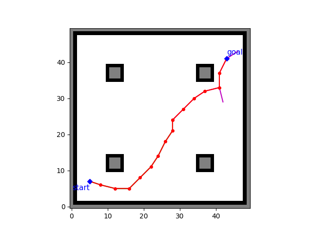
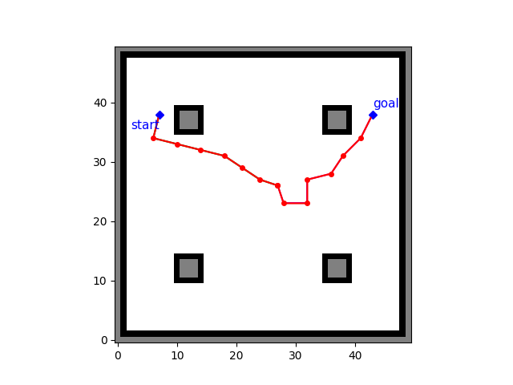

# Rapidly-Exploring Random Tree (RRT)

Version 1 of Bi-directional RRT has been done and tested.

Input: grid map (.txt), start point, goal, epsilon (step size), robot radius, world map size, resolution of grid map.

Output: a tree graph and a path from start to goal node.

## Feature Summary:

Have's:

* Random sample generator
* Goal-unbiased sampling: currently no bias/heuristics is added
* Collision check
* Animation

Doesn't Have's:

* Goal-biased sampling
* Path smoothing

## Future Plan:

* Add those currently unavailable features
* Data structure optimization

## Dependencies:

* numpy
* matplotlib
* math
* Occupancy_Grid_Mapping

## Quick Demo:

