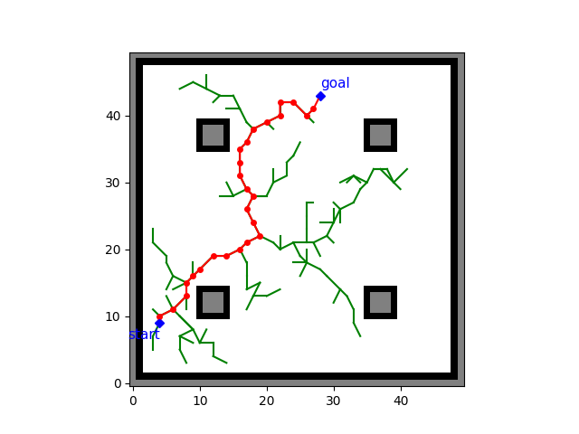
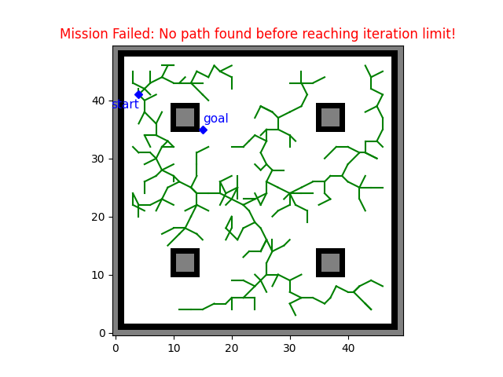

# Rapidly-Exploring Random Tree (RRT)

Version 1.2 of RRT has been updated and tested.

Input: grid map (.txt), start point, goal, epsilon (step size), robot radius, world map size, resolution of grid map.

Output: a tree graph and a path from start to goal node.

## Update from previous version:

* Generic world map size
* Added a file (Mapping_and_PathPlanning) to do all by one click: run the simulation -> occupancy grid mapping -> path planning.

## Feature Summary:

Have's:

* Random sample generator
* Goal-unbiased sampling: currently no bias/heuristics is added
* Collision check
* Animation

Doesn't Have's:

* Goal-biased sampling
* Path smoothing
* Generic grid map: currently square grid map is assumed.

## Future Plan:

* Add those currently unavailable features
* Data structure optimization

## Dependencies:

* numpy
* matplotlib
* math
* Occupancy_Grid_Mapping

## Quick Demo:

https://user-images.githubusercontent.com/63512723/235427834-49c4389c-5919-4861-952b-32e57501c95b.mp4
